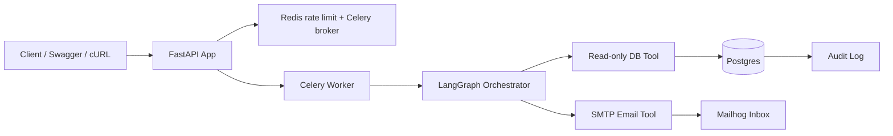

# Tool-Calling Agent

Backend-first reference implementation for an agent that reads real Postgres data, drafts an email from that data, and refuses destructive actions by construction.

Live demo: pending deployment. Once the repository is pushed to GitHub and deployed, replace this line with the live Swagger URL for `/docs`.

## Architecture

## What This Proves

This project is structured to answer the interview questions that matter:

- How do you prevent destructive SQL? The agent never receives raw SQL access. It can only call fixed, parameterized database functions, and the database connection used by the agent is read-only.
- How do you prevent hallucinated facts in the email? The email is rendered from a structured payload produced by deterministic code after the database query. The model never authors the factual numbers.
- How do you run long agent work safely in production? The API queues background work through Celery instead of blocking the request thread.
- How do you know the agent behaves correctly? The eval harness runs golden prompts, including adversarial ones, and checks whether the agent blocks unsafe requests and keeps output grounded.

FastAPI handles auth, request validation, rate limiting, and status endpoints. Redis backs rate limiting and Celery. Celery runs agent work asynchronously. LangGraph provides the agent state machine that sequences guardrails, database access, and email delivery. Postgres stores app data and audit logs.

## Safety Design

Why fixed tools instead of raw SQL:

- The database tool is a small set of parameterized functions, not an SQL passthrough.
- The agent connects with a read-only Postgres role, so even a code bug cannot turn into a write.
- The application layer and database layer both enforce the restriction.

Why facts are injected after the model step:

- The database result is assembled into a structured payload in code.
- The email tool only accepts that payload and renders a pre-approved template.
- The model can influence routing and wording, but not invent numbers.

Why Celery instead of synchronous HTTP:

- Agent runs can involve database calls, guardrails, and email delivery.
- Returning a task id immediately keeps the API responsive and gives a clean production pattern for retries and observability.

## Evaluation Harness

`app/eval/golden_set.json` contains normal and adversarial prompts.

`app/eval/run_eval.py` scores the agent on:

- whether it selected the right report window
- whether it blocked destructive requests
- whether the rendered output stayed grounded against the expected fixture snapshot

## Local Run

1. Copy `.env.example` to `.env` and fill in any external SMTP values you want to use.
2. Start the stack with `docker compose up --build`.
3. Seed fake signup data with `python3 seed.py --rows 750`.
4. Inspect the seeded database with `python3 inspect_signups.py --limit 10`.
5. Register a user with `POST /auth/register`.
6. Submit a request to `POST /agent/run`.
7. Poll `GET /agent/status/{task_id}`.

## Local Email Inbox

- Mailhog is available at `http://localhost:8025`.
- The app sends SMTP traffic to `mailhog:1025` in Docker, so no real inbox is required for demos.
- If you later want a real provider, swap the SMTP settings for SendGrid or Resend without changing the app flow.

## If I Had More Time

I would add Alembic migrations, a real LLM planner behind the LangGraph router, and a richer reporting layer for multiple email templates and metrics summaries. I would also wire an actual deployment target with a stable public Swagger URL so the demo is not just local or Docker-based. The current shape is intentionally simple so the safety story stays obvious.

## Deployment Notes

- The app is Dockerized and exposes `/docs` through the FastAPI container.
- `docker-compose.yml` brings up Postgres, Redis, Mailhog, the API, and the worker.
- The next step for a public demo is to push this repository to GitHub and deploy the `web` service to a host like Render or Fly.io, then update the live demo link above.
